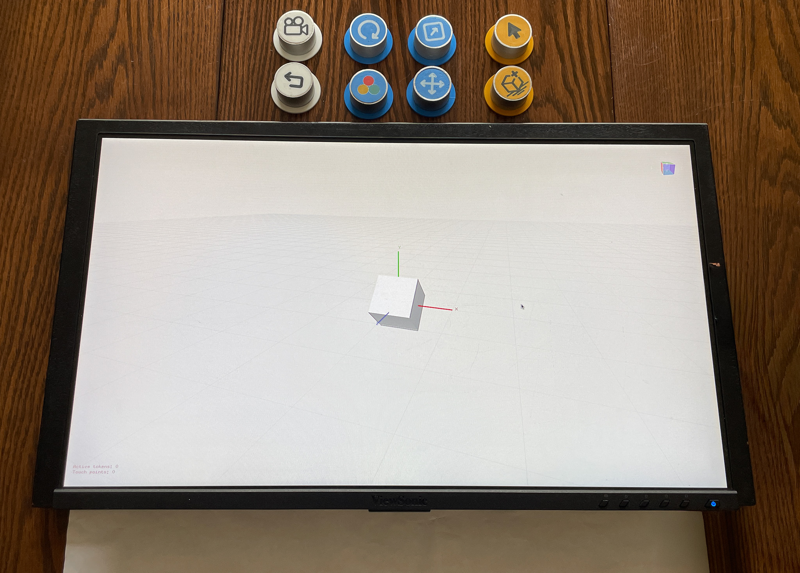

# TATRI
## Tangible Tridimensional Interface

Sistema de interacción tangible para manipulación tridimensional sobre pantallas táctiles mediante objetos físicos.

---

## Descripción

TATRI explora nuevas formas de interacción tridimensional utilizando herramientas físicas sobre superficies táctiles para manipular objetos digitales 3D de manera más intuitiva.

El sistema busca reducir la complejidad de las interfaces tridimensionales tradicionales aprovechando habilidades motoras cotidianas y mejorando la comprensión espacial en usuarios novatos.

---

## Tecnologías

- C++
- OpenFrameworks
- TUIO
- Interfaces Tangibles (TUI)

---

## Características

- Manipulación tangible de objetos 3D
- Rotación, traslación y escalado
- Interacción multitáctil
- Feedback visual en tiempo real

---

## Documentación

La memoria completa del proyecto se encuentra en:
## Documentation

[📄 View Full Project Documentation](docs/Castaner_Pedro_MFinal.pdf)

---

## Demo

Video demostrativo:

## Demo Video

[🎥 Watch Demo Video](https://youtu.be/i7j0NpMe4HE)

## Screenshots

---

## Autor

Pedro Castañer
